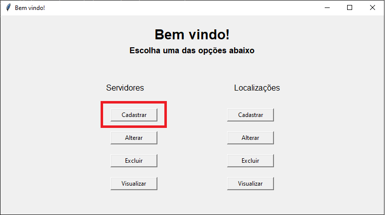

# Botão Pânico para hospitais públicos
Esse diretório contém os arquivos para o funcionamento do botão pânico em hospitais públicos ou outros ambientes que possa haver a necessidade de um pedido de socorro através de computadores.\
A pasta "diagrama de classes" como o próprio nome diz, contém o diagrama de classes do projeto\
O projeto foi inteiro desenvolvido com a linguagem Python 3.8 e tem como requisito funcionar em qualquer sistema operacional baseado em Windows, como: XP,7,8,8.1,10,11 ou Debian/Linux, como: Debian, Ubuntu, Mint, dentre outros.\
 
Instalação do Cliente (Computador que envia pedido de socorro):\
1- Realizar a instalação do software Python, podendo ser das versões 2.x ou 3.x\
2- Instalar através do pip a extenção sqlalchemy. Comando no terminal: pip install sqlalchemy.\
3- Abrir o script InterfacePaginaInicial para fazer o cadastro do computador que receberá o pedido de socorro. Comando no terminal: python InterfacePaginaInicial.py\
 

 
4- Cadastre o IP e a Descrição do computador que receberá o pedido de socorro\
5- Executar classe tcpCliente para enviar o pedido de socorro. Comando terminal: python tcpCliente.py\
 
Instalação do Servidor (Computador que recebe pedido de socorro):\
1- Realizar a instalação do software Python, podendo ser das versões 2.x ou 3.x\
2- Instalar através do pip a extenção sqlalchemy. Comando no terminal: pip install sqlalchemy.\
3- Caso queira apenas receber o pedido de socorro, executar a classe tcpServidor. Caso queira além de receber o pedido, descriver a ocorrência para estudo posterior, executar a classe tcpServidorComOcorrencia. Comando terminal: "python tcpServidor.py" ou "python tcpServidorComOcorrencia.py"\
 

Observações necessárias:\
- É necessário cadastrar o IP do servidor para poder enviar o pedido de socorro.\
- O pedido enviado pelo cliente só chegará ao servidor, se o servidor estiver com o tcpServidor sendo executado. !Dica: Executar comando para abrir tcpServidor ao ligar o computador\
- Caso seja necessário alterar o nome da localização do computador, executar a classe InterfaceAlteraLocalizacaoAtual. Ela tem como base a tabela Todas_Localizações, dessa forma, antes de alterar a localização atual é necessário cadastrar esse novo endereço na tabela Todas_Localizações usando as interfaces de localizações ou usando a classe DAOLocalizações.\